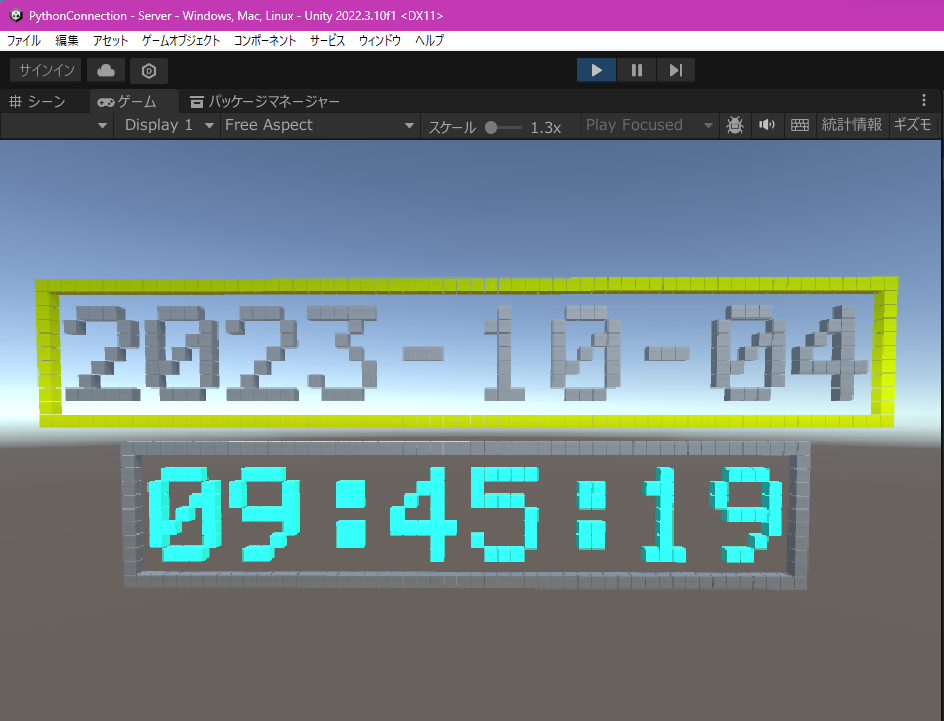

# Naohiro2g / minecraft_remote_unity

Minecraft Remote for Unity

## Quick start

1. Open the project in Unity
2. Open the scene named "send demo"
3. Run the scene to see how it works.

You will see some cubes, pyramids, or columns built in the scene.

[](.images/send_receive_demo_unity.png)

### Server/receiver

Empty game object named "Server" has TCPServer.cs and MinecraftRemoteReceiver.cs attached. These scripts are for receiving Minecraft Remote messages from Python client.

### Client/sender

The sender script MinecraftRemoteSender.cs is also attached to the "Server". It sends messages produced by demo scripts to the server in the format of Minecraft Remote.

Building demo scripts send_demo_01.cs and send_demo_02.cs are attached to the red capsule.

These four scripts will be started automatically when you run the scene.

## A brother project of [Minecraft Remote](https://github.com/naohiro2g/minecraft_remote) for Unity

### Server/receiver: Python to Unity world

- It allows you to build something/anything in Unity world with blocks/voxels in Python.
   C# server listens to Python client and builds blocks in Unity world.
- The Python codes are fully compatible with the Minecraft Remote.

### Client/sender: C# to Unity world, or Minecraft world

- You can write code in C# in place of Python.
   C# client sends commands to the C# server, then receiver builds blocks in Unity world.
   Or you can send commands to Minecraft world with the same code.

## Script files

### C# scripts in [/Assets/Scripts/](/Assets/Scripts/)

These scripts are all attached to the game object "Server" in the scene "send demo" so that these scripts will be started automatically when you run the scene. The server concurrently listens to command sequences from all builder scripts and objects will be built in parallel manner.

You can write builder scripts in C# then attach them to any game object in the scene.
The Server, Receiver, and Sender scripts must be attached to the game object "Server".

#### Server

- [TCPServer.cs](/Assets/Scripts/TCPServer.cs): TCP server, which is multi-threaded listener for multi-client.

#### Receiver

- [MinecraftRemoteReceiver.cs](/Assets/Scripts/MinecraftRemoteReceiver.cs): Receiver for Minecraft Remote messages and also woks as message parser and object renderer.

#### Sender

- [MinecraftRemoteSender.cs](/Assets/Scripts/MinecraftRemoteSender.cs): Sender for Minecraft Remote messages. It reads command messages produced by builder scripts and sends them to the server.

#### Builder

You can attach these scripts to any game object in the scene.

- [send_demo_01.cs](/Assets/Scripts/send_demo_01.cs): C# sender demo
- [send_demo_02.cs](/Assets/Scripts/send_demo_02.cs): C# sender demo #2

### Python scripts in [/PythonScripts/](/PythonScripts/)

#### Sender/builder

Try running these scripts concurrently, then you will know the Unity server/receiver can build objects in parallel manner.

- [set_columns1.py](/PythonScripts/set_columns1.py): builds columns
- [set_columns2.py](/PythonScripts/set_columns2.py): builds columns
- [set_pyramids.py](/PythonScripts/set_pyramids.py): builds pyramids
- [set_maze.py](/PythonScripts/set_maze.py): builds mazes

[](./images/digitalclock.png)

- [digitalclock.py](/PythonScripts/digitalclock.py) to display a realtime clock with time and date using 5 x 7, LCD font in the format as follows (also shown in the picture above):

```DateTime
        2023-10-04
         09:45:19
```
